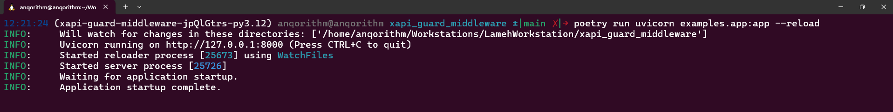
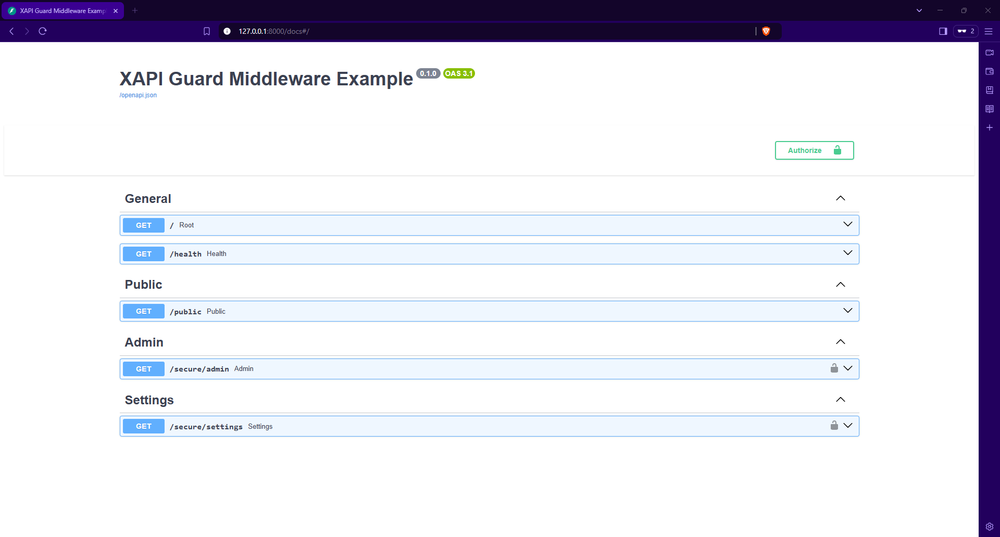
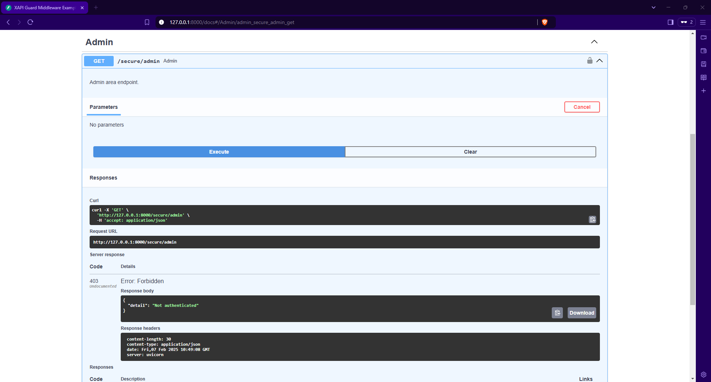
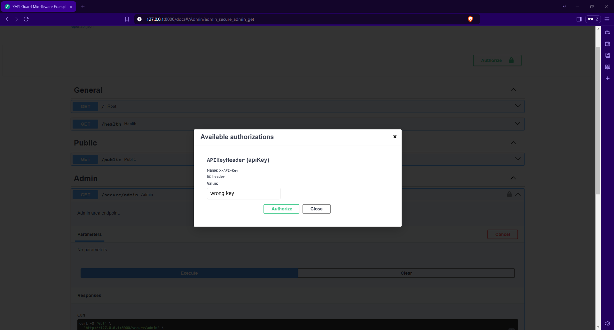
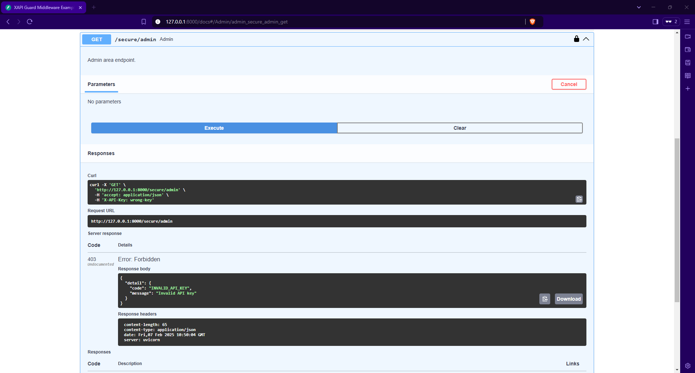
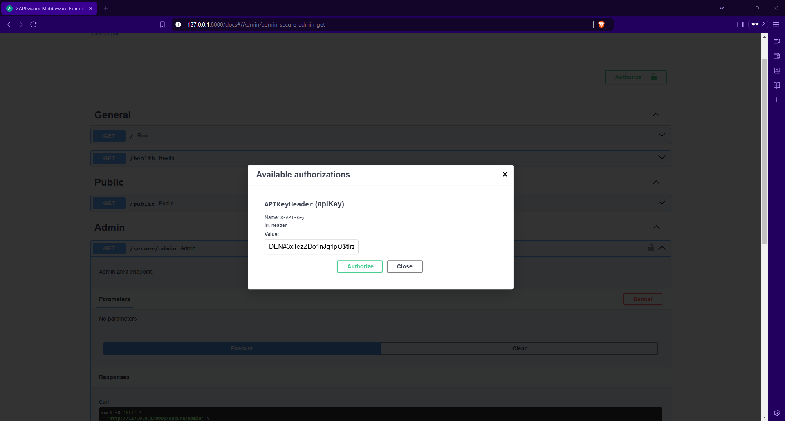
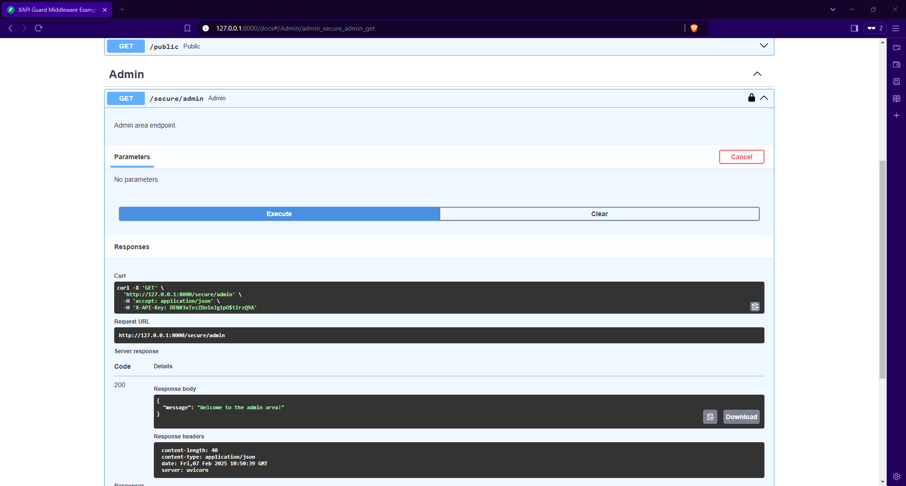

# XAPI Guard Middleware

[](https://pypi.org/project/xapi-guard-middleware/)
[](https://img.shields.io/pypi/v/xapi-guard-middleware)
[](https://opensource.org/licenses/MIT)


[](https://github.com/psf/black)
[](https://docs.pytest.org/)
[](https://coverage.py/)

XAPI Guard is FastAPI middleware that protects your API endpoints by validating the X-API-Key header. It's designed in a decorator style, so you can annotate your FastAPI endpoints with `@guard.protect` to protect them.

## Features

- Protect your FastAPI endpoints by validating the `X-API-Key` header.
- Use `@guard.protect` to secure specific routes or entire routers.
- Easily configure which routes require protection and which are public.
- Automatically handle unauthorized access with appropriate error messages.
- Support for OpenAPI/Swagger documentation with protected routes.

## Installation

Choose your preferred installation method:

### Poetry (Recommended)
```bash
poetry add xapi-guard-middleware
```

### Pip
```bash
pip install xapi-guard-middleware
```

## Quick Start

```python
from fastapi import FastAPI, Depends, APIRouter
from xapi_guard_middleware import XAPIGuardMiddleware

app = FastAPI(title="XAPI Guard Middleware Example")

guard = XAPIGuardMiddleware(x_api_key="sk_85BnHrWHbLEKty7gNXVSwP385eLZipN6UvlSRjcvOXucwWq7MqAmvB5PhQ5xhy5n0uVFxluUuomCzRpoNuL7ffEnMApAs9hwIUDtoWN1je9ZYIkqAz6qrVSWdbZs8")

# Routers for different route groups
admin_router = APIRouter(dependencies=[Depends(guard.protect)])
settings_router = APIRouter(dependencies=[Depends(guard.protect)])
public_router = APIRouter()

# General routes
@app.get("/", tags=["General"])
async def root():
    """Root endpoint returning a welcome message."""
    return {"message": "Hello World"}


@app.get("/health", tags=["General"])
async def health():
    """Health check endpoint to verify service status."""
    return {"status": "healthy"}


# Public routes
@public_router.get("/public", tags=["Public"])
async def public():
    """Public endpoint accessible to everyone."""
    return {"message": "This is a public endpoint accessible to everyone."}


# Admin routes
@admin_router.get("/admin", tags=["Admin"])
async def admin():
    """Admin area endpoint."""
    return {"message": "Welcome to the admin area!"}


# Settings routes
@settings_router.get("/settings", tags=["Settings"])
async def settings():
    """Settings page, accessible only to authorized users."""
    return {"message": "Settings page, accessible only to authorized users."}


# Include the routers in the main app
app.include_router(public_router)
app.include_router(admin_router, prefix="/secure")
app.include_router(settings_router, prefix="/secure")
```

## Demo

### Running the FastAPI app

```bash
$ poetry install

$ poetry shell

$ poetry run uvicorn examples.app:app --reload
```

* The FastAPI app is running on http://localhost:8000


### Making Requests

```bash
# Unauthorized request (invalid API key)
curl -X GET http://localhost:8000/secure/admin -H "X-API-Key: wrong-key"
# {
#   "detail": {
#     "code": "INVALID_API_KEY",
#     "message": "Invalid API key"
#   }
# }
# Status code: 403

# Authorized request
curl -X GET http://localhost:8000/secure/admin -H "X-API-Key: YOUR_API_KEY"
# Response: {"message": "Welcome to the admin area!"}
# Status code: 200
```

* The FastAPI app is protected by the XAPI Guard Middleware


* X-API-Key header is missing


* X-API-Key header is invalid



* X-API-Key header is valid




## Contributing

Contributions are welcome! Please open an issue or submit a pull request.
## Contributors

- [Abdullah Alqahtani](https://github.com/anqorithm)

## License

This project is licensed under the MIT License. See the [LICENSE](LICENSE) file for details.
